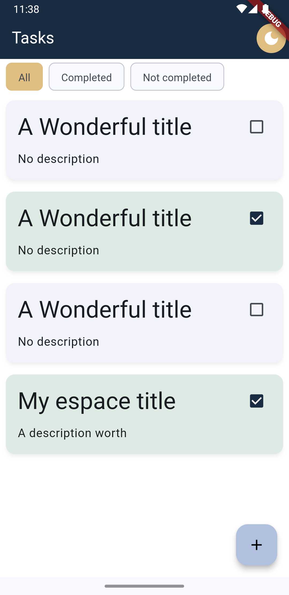

# Task Management
### Tested with Flutter 3.27.0 and Dart 3.6.0

## Install Extensions (VS Code / Android Studio / Intellij)
- Flutter
- Dart
- Build Runner
- Freezed (Optional)
- FlutterFire

### run `flutter pub upgrade` and `flutter pub get`

### API
Firebase Realtime Database

If you want to use your own project first you must create it in Firebase or with firebase CLI. Configure your own firebase project by deleting all files related to it:
- .firebaserc
- firebase.json
- android/google-services.json
- ios/Runner/GoogleService-Info.plist
- firebase_options.dart

# Install the CLI if not already done so
dart pub global activate flutterfire_cli

# Run the `configure` command, select a Firebase project and platforms
flutterfire configure

---

### run `flutter pub run build_runner build` (with `--delete-conflicting-outputs` if there are any conflict files)
    - `watch` to continuosly rebuild at each
    - `build` for manually
---
### Lib
Following [FSD](https://feature-sliced.design/docs) folder structure with Clean Architecture

- app
    - style implementation
    - route provider retrieving a Route 2.0 router (Go Router)
    - providers injected in main
- common
    - widget
        - Common UI and interface components
    - router
        - route constant names
    - lib
        - classes, extensions, constants, validators, etc. all kind of code that provides certain functionality or logic without being part of a feature
- features
    - each feature has its own subfolders in the format of:
        - widget
            - UI components and Flutter widget related classes
        - application
            - controller
                - ChangeNotifier controllers that connects to domain services (also providers) to get domain entities and VO to make reactive UI 
        - domain
            - exceptions
                - each domain has its own business rule and exception
            - Interfaces
                - Repositories
            - model
                - domain entities and VO
                - immutable (anemic) domain
            - service (use cases)
                - Service use case (if any), this are interfaces that provide a way to get domain objects
        - infrastructure
            - mapper
                - utility functions and classes to transform inner DTOs to domain objects
            - data implementations
                - external services to get information from (repository implementations)
            - model
                - models used by the data source, this are not part of the domain because are just intermediate from the data source to a real domain entity (DTOs from HTTP, local DB, etc)   
- page
    - each page has a set of inner attributes:
        - controller
        - ui
---
- The app has 1 feature with 2 use cases:
    - Tasks
        - Create a new task
        - Update state of a task (complete or incomplete)

Page is the front end UI where it displays the information to the user, creating the controllers for each page (MVVM) and calling the corresponding use case of the business logic to finally do the action.

Feature is the list of all features following Clean Architecture and SOLID (Domain interfaces used in infrastructure and passed to application layer or controller).

Common is a folder where all dependencies are of feature, app and page are implemented, it can be used for utility services, routes, data sources (API), styles and widgets across different pages.

App implements services that are used across all app and is not part of a feature, but part of the app itself (ThemeStyle, Auth, RouterConfiguration, Env Configuration)

The idea is to have this providers from the data source to the actual controller that will be used in the UI (infrastructure -> repository/service -> controller).

For testing in debug mode in firebase emulator start it with firebase cli:

firebase emulators:start

Or remove conditional line 20 in main.dart

---
### [analysis_options.yaml](analysis_options.yaml)
- Ignore lint and modify dart analyzer (usually autogenerated)
---
### [build.yaml](build.yaml)
- Configuration for libraries that depends on build_runner (json_serializable and Freezed generator)
---

## Screenshots

 